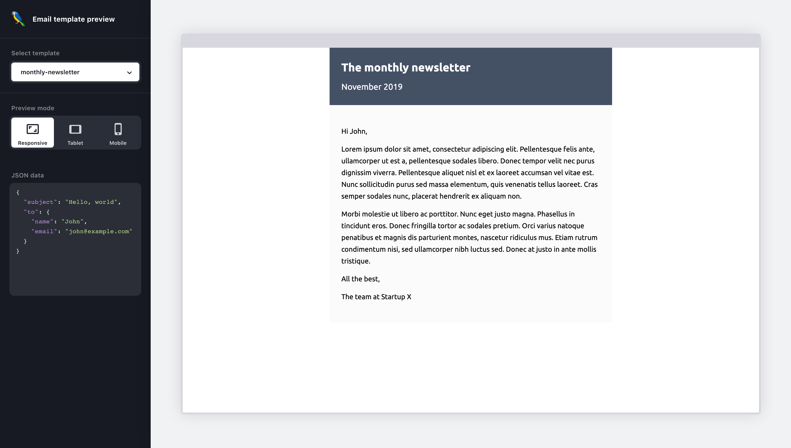

# Preview UI for Macaw

The preview UI for Macaw helps view the compiled mjml file, markdown and JSON data. It is built with [react](https://reactjs.org/), and fetches the updated templates using [socket.io](https://socket.io/) from the macaw cli.
 



**[Disclamer] This package is intended to be consumed internally by the macaw cli**

## Getting Started

These instructions will get you a copy of the Preview UI running ready for development. All commands assume starting at the repositories root folder

First in the cli folder install the dependencies
```bash
cd packages/cli  && yarn install
```

Second run the macaw cli pointing it towards the template directory

```bash
yarn start preview --source templates
```

Then in a new terminal promt install the dependencies for the preview UI

```bash
cd packages/preview-ui && yarn install
```

Finally start the UI in development mode
```
yarn start
```

The development server will start on port 3000. The preview-ui automatically connects to the [socket.io](socket.io) server started by the cli.
